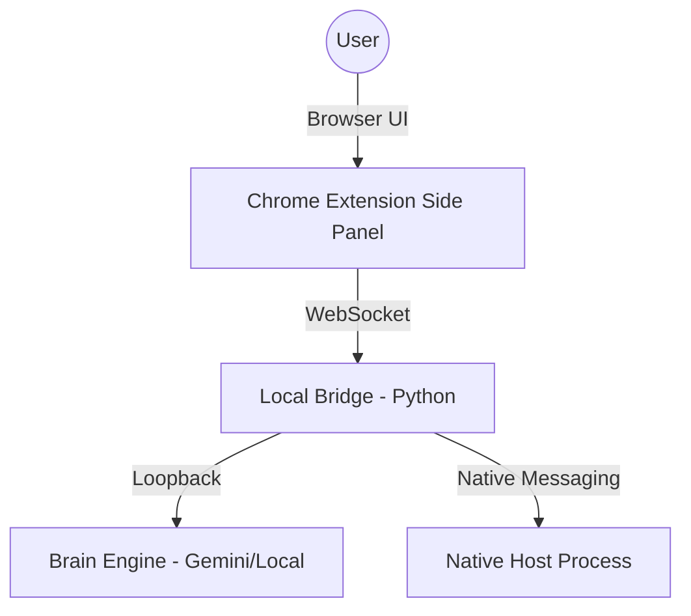

# Architecture — AI Intercom

## Overview
AI Intercom uses a hybrid architecture consisting of a Chrome Extension and a Local Bridge.

## Components

### 1. Chrome Extension (MV3)
- **Side Panel**: Main UI for chat.
- **Service Worker**: Handles connection persistence and tab context.
- **Storage**: Uses `chrome.storage.local` for message history.

### 2. Local Bridge (Python)
- **aiohttp server**: Provides the WebSocket endpoint at `localhost:8765`.
- **Relay Logic**: Routes messages between the extension and various "brains".

### 3. Brain Engine
- **Gemini Flash**: Default autonomous engine.
- **Context Handling**: Injects tab metadata into the prompt.

### 4. Native Host
- **Host Connector**: Allows the extension to trigger the bridge automatically if it's not running.
